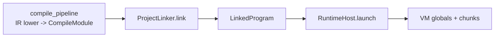
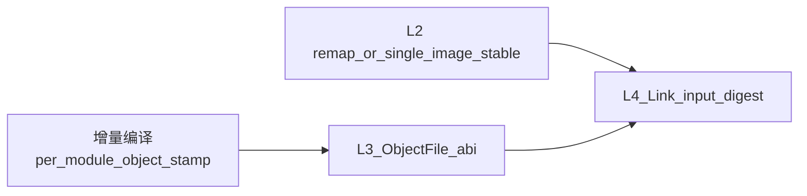

# Linker 演进方案

日期：2026-05-01  
状态：路线图（随实现迭代修订）  
关联：[重构边界残余检查（meta 向）](../meta/refactor_boundary_residual_audit_2026-05-01.md)、[P0 项目体检](../audits/project_health_p0_audit.md)

## 1. 文档目的

本文件回答三类问题：

1. **现状**：链接在流水线中的位置、输入输出契约、`runtime`/`VM` 依赖哪些**显式或隐含**约定。  
2. **缺口与风险**：哪些能力「看起来已具备、但未与执行路径闭环」。  
3. **分阶段演进**：在**需要落盘中间产物与增量链接**的前提下，如何分阶段交付，每阶段含**范围、交付物、验收口径**。  
4. **与增量编译的关系**：总体规划上会有「增量编译」设计；本节将链接侧缓存失效与编译侧粒度对齐说明，避免两套路由键不一致。

---

## 2. 术语（固定用法）

| 名词 | 含义 |
|------|------|
| **Compile artifact（进程内）** | 当前 [`CompileModule`](../../include/niki/l0_core/linker/linker_facade.hpp)：单模块编译产物，含 `init_chunk`、导出表等。 |
| **Object artifact（落盘）** | 未来引入的模块化中间文件（格式待定），可由编译器写出、由链接器读入，支撑缓存与增量。 |
| **Load image（可启动镜像）** | 当前 [`LinkedProgram`](../../include/niki/l0_core/linker/linker_facade.hpp)，或未来替换为带版本/重定位状态的 `LoadableProgram` 等更强类型。 |

**标准实现位置**：[`meta::project::ProjectLinker`](../../include/niki/meta/project/project_linker.hpp)（实现见 [`project_linker.cpp`](../../src/meta/project/project_linker.cpp)）。  
**稳定门面**：[`niki::linker::Linker`](../../include/niki/l0_core/linker/linker_facade.hpp) 仅转发到 `ProjectLinker`。

---

## 3. 现状数据流

- **编译后端**（[`compile_pipeline.cpp`](../../src/meta/orchestrator/compile_pipeline.cpp)）产出 `CompileModule`：含每模块 `init_chunk`、`exports`、`exported_symbols` 等。  
- **链接**（[`project_linker.cpp`](../../src/meta/project/project_linker.cpp)）汇总多模块，做字符串池合并（写入 `LinkedProgram.string_pool`）、导出符号采集、重复符号与入口决议，填充 `LinkedProgram.init_chunks` 与 `entry_name_id`。  
- **运行**（[`runtime_host.cpp`](../../src/meta/runtime_host/runtime_host.cpp)）顺序执行每个 `init_chunk`，再 `vm.lookupGlobalFunctionById(program.entry_name_id)` 调用入口。

---

## 4. 执行层不变量（当前行为，需在 L0 写死并测）

以下事实来自 [`vm.cpp`](../../src/l0_core/vm/vm.cpp) 与 `RuntimeHost` 的配合，**链接器与启动器文档必须与之对齐**。

1. **Init 顺序**：`RuntimeHost` 按 `LinkedProgram.init_chunks` 的**向量顺序**依次 `executeChunk`；无拓扑排序、无并行。  
2. **每 chunk 的字符串池**：`VM::executeChunk` 将 `current_string_pool` 设为**该 chunk 自带**的 `chunk.string_pool`，而非 `LinkedProgram.string_pool`。  
3. **全局函数表键**：`OP_DEFINE_GLOBAL` 将函数登记到 `globals`，键为 **`ObjFunction::name_id`**（与 IR lower 中 `func_name_sid` 一致），不是「当前 chunk 内名字串在池中的下标」这一概念本身。  
4. **入口解析**：`program.entry_name_id` 必须与上述 `name_id` 一致，否则 `lookupGlobalFunctionById` 失败。当前 `ProjectLinker` 用导出信息中的 id 与名字匹配入口名（见 `collectDefinedSymbols` 与 `options.entry_name`）。

**关于 `LinkedProgram.string_pool`**：链接阶段会合并各模块 chunk 的字符串去重后写入该字段，但 **`RuntimeHost` 执行路径不读取它**。若仅用于诊断/调试/未来重映射，应在类型或文档中标注角色，避免调用方误以为「执行已切换到全局池」。

---

## 5. 已实现能力 vs 契约缺口与风险

### 5.1 池合并与操作数语义

- **现象**：存在项目级合并的 `LinkedProgram.string_pool`，但各 `init_chunk` 仍携带**各自的** `string_pool` 与常量索引。  
- **风险**：一旦各模块池布局不再与「跨模块 SID/索引一致」假设对齐，仅靠当前「合并池」易出现**静默错执行**：诊断或工具看到全局池，但 VM 实际按 per-chunk 池解释操作数。  
- **对策方向**：见阶段 **L2**（显式 remap 或单一 image chunk），并在类型上标明「是否已完成重定位」。

### 5.2 重复符号检测模型

- **现象**：`ProjectLinker` 用**符号名字符串**（从各模块池取出）检测重复导出。  
- **与 VM 的关系**：运行时冲突由 `globals[name_id]` 决定；在**全局 intern 与编译管线保证 SID 一致**的前提下，名字级检测与 SID 级注册可对齐。  
- **风险**：引入 per-module 池、重命名导出、不同模块相同显示名不同 SID 等时，必须把**符号主键模型**统一到链接器与 VM（见 **L1**）。

### 5.3 测试覆盖

- 当前 [`test/linker/linker_test.cpp`](../../test/linker/linker_test.cpp) 覆盖：重复符号、缺失入口的诊断行为。  
- **建议增补矩阵**（随阶段落地）：多模块入口 `name_id` 与索引布局不一致时的行为、remap 后执行、落盘 object 往返、增量缓存命中/失效。

---

## 6. 分层边界（避免再次泄漏）

建议固定为：

| 层次 | 职责 |
|------|------|
| `meta::precompile` / `compile_pipeline` | 产出 **compile artifact** 或未来 **object artifact**；不决策项目级符号冲突与入口唯一性。 |
| `meta::project::ProjectLinker`（或未来 `IncrementalLinker`） | 只消费 **稳定 ABI 的链接输入**；完成符号/池/重定位策略与诊断。 |
| `meta::runtime_host` / `l0` VM | 只消费 **已达启动不变量** 的 load image（未来可要求「已 remap」状态或镜像版本号）。 |

---

## 7. 分阶段路线图（含落盘与增量链接）

**产品前提**：中期需要 **落盘中间产物** 与 **增量链接**（减少全量重链、支撑 CI 缓存）。

**L2 与 L3 顺序**：可先 **L2（内存内 remap 闭环）** 再 **L3（落盘）**，避免未验证的池语义被固化进文件格式；若优先落盘，必须在格式中带 **版本号与能力位**，并允许 L2 修正后 bump 版本。

| 阶段 | 主题 | 主要交付物 | 验收口径（示例） |
|------|------|------------|------------------|
| **L0** | 约束显式化 | 本文档 + 对 `LinkedProgram`/`CompileModule` 注释或轻量字段说明（`string_pool` 角色、init 顺序） | 测试或文档锁定「init 顺序、入口键为 `name_id`、执行不读 `LinkedProgram.string_pool`」等不变量 |
| **L1** | 符号标识模型 | 链接器内部 **SymbolId**（或 kind + module + sid/ordinal）；诊断仍展示用户可见名 | 重复定义/入口决议与 `VM::globals` 键一致；错误可定位到模块与源路径 |
| **L2** | 重定位：池合并 + remap | 列出 chunk 内依赖池/常量索引的操作数；实现 **全局池 + per-chunk remap** 或 **合并为单一 init image chunk**（二选一文档化 trade-off） | 多模块下不依赖「偶然相同」的池布局；`entry` 与全局调用链在 remap 后仍正确 |
| **L3** | 落盘 Object + 稳定链接输入 | **ObjectFile** 规范：魔数/版本、sections（code、string_pool、exports、relocs、可选 debug map）、与 `CompileModule` 的字段对应关系；**LinkJob**（object 路径列表 + `LinkOptions`） | 磁盘 object 集合经链接得到与当前内存链接**行为等价**的 `LinkedProgram`（或新 `LoadableProgram`） |
| **L4** | 增量链接 | 模块内容 hash、object 缓存键、仅重编译变更模块与重链策略；缓存失效条件（选项变更、依赖图变化、工具链版本） | 单文件改动时显著减少链接工作量；CI 可复现、可清理缓存 |
| **L5** | 工程化 | 与 [`docs/diagnostics/core_error_codes.md`](../diagnostics/core_error_codes.md) 对齐；link report（输入 object、决议结果摘要） | 链接错误可定位到 object/偏移；日志可观测 |

---

## 7.1 与增量编译（Incremental Compile）的衔接

后续「增量编译」与本文 **L4 增量链接** 是上下游关系：**编译侧决定哪些 object 需要重生或标记脏**；**链接侧在稳定输入与不透明摘要下决定是否可复用上一轮 `LinkedProgram` 或等价中间结果**。建议在设计增量编译路线时对齐以下约束。

### 分层职责（避免两把尺子）

| 层级 | 典型失效条件（示例） | 产出 |
|------|----------------------|------|
| **增量编译** | 源码内容 hash、预处理/模块接口戳、语义环境戳（全局符号骨架、intern 代数）、编译选项与工具链版本 | 每模块更新的 **object** 或可证明未变的 **缓存命中** |
| **增量链接** | object 集合摘要、`LinkOptions`、工具链/链接策略版本；若存在跨模块语义影响（见下），须纳入 **项目级印章** | 复用 load image，或只对变更 object 做一次轻量重链（若日后支持 partial link） |

### 必须纳入链接输入摘要的信息（否则会 silent wrong）

- **工具链与策略**：编译器版本、lower 契约版本、`LinkOptions`、`ProjectLinker` 行为版本标识。  
- **跨模块耦合**：任一模块导出/公有接口变化，可导致**其它未改文件的链接语义**变化（符号冲突、入口可见性、`init_chunks` 合并顺序的预期）。增量编译若为「文件级粒度」，链接缓存键仍需要 **依赖图闭合集**或 **导出 API 哈希**，不能只凭单文件 stamp。  
- **L2 与增量的先后顺序**：在未完成「池合并 + remap」或等价不变量闭环前做大规模链接缓存，容易把错误的池语义**固化进缓存**。建议：**L2 行为稳定后再主推 L4 命中路径**。

### 推荐演进顺序（与增量编译团队协作）

---

## 8. L3：ObjectFile 设计要点（草案级）

以下内容在格式定稿前均为**开放设计**，实现时应单独 PR 引入规范与版本。

- **必须**：文件魔数、**format version**、**toolchain id**（compiler/linker 版本或哈希），以便拒绝不兼容组合。  
- **建议 sections**：`STR`（字符串表）、`CODE`（chunk 字节码与元数据）、`EXPORT`（导出符号表）、`RELOC`（重定位记录）、`DBG`（可选，源映射）。  
- **与增量关系**：object 需含足够信息使 **L4** 能判断「仅该 object 过期」而无需重编全项目。

---

## 9. 开放问题（待产品/语言语义拍板）

以下问题会显著影响 L1–L4 的形态，结论应回填本文档。

1. **Object 编码**：二进制为主，是否同时需要 JSON/文本辅助调试；是否对仓库外工具暴露（稳定性 SLA）。  
2. **Init chunk 顺序**：是否长期保持「编译单元枚举顺序」，或改为 **import/依赖图拓扑**；是否允许并行 init（若允许，需定义 VM 全局表可见性规则）。  
3. **重复符号策略**：一律硬错误，还是允许弱符号、后载覆盖等。  
4. **调试与溯源**：链接期是否强制保留 `source_path`、符号到 object 的稳定映射（与 `SymRecord`、诊断 span 的衔接）。  
5. **L2 路径选择**：优先「全局池 + remap」还是「单合并 chunk」；后者实现简单但可能损失模块边界与调试粒度。  
6. **增量编译与增量链接契约**：编译缓存键与链接输入摘要的统一格式（谁在 orchestrator 聚合成单一 `BuildStamp`）。

---

## 10. 文档验收（读者 Checklist）

读者在约 10 分钟内应能回答：

- 链接器解决的是哪些**项目级**问题（与语义/单模块编译的边界）？  
- 今天 `LinkedProgram` 被 **RuntimeHost/VM** 如何使用？`string_pool` 未参与执行的含义是什么？  
- 当前最大的 **silent wrong** 风险来自哪里？  
- 落盘与增量链接在路线图中处于哪一阶段、依赖哪些前置（尤其 L2）？  
- 下一阶段（L0/L1）的**可测完成定义**是什么？

---

## 11. 修订记录

| 日期 | 变更摘要 |
|------|----------|
| 2026-05-01 | 初版（现状、不变量、风险、L0–L5、落盘/增量前提、开放问题）；增补 §7.1 与增量编译衔接及开放问题 6 |
