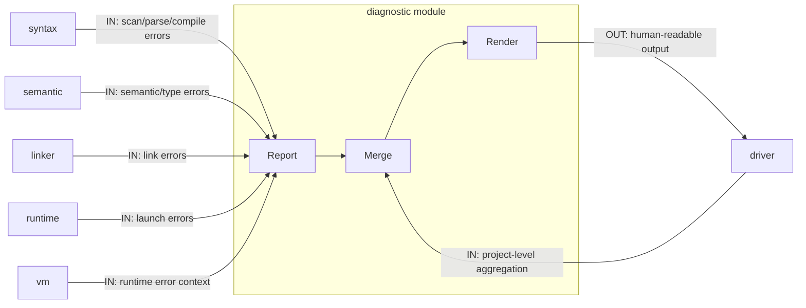

# Diagnostic 模块说明

`diagnostic` 提供统一的诊断数据结构、事件化错误码与渲染能力。

## 职责

- 统一承载跨阶段诊断（Scanner/Parser/Semantic/Compile/Link/Runtime/Driver）
- 提供标准化错误码与位置信息
- 负责诊断渲染输出

## 模块内数据流

## 数据边界

- 输入：各阶段上报的错误/警告
- 输出：可聚合、可渲染、可传播的 `DiagnosticBag`

## 模块间依赖

- 依赖模块
  - 无业务依赖；作为基础设施层独立存在。
- 被依赖模块
  - `driver`、`syntax`、`semantic`、`linker`、`runtime`、`vm` 全阶段引用。

## 阶段接口（对外）

- Emit
  - 输入：阶段事件（`events::*Event`）、消息、源码位置
  - 输出：追加到 `DiagnosticBag`
- Merge
  - 输入：多个诊断集合
  - 输出：统一诊断包
- Render
  - 输入：诊断包 + 源信息
  - 输出：终端/日志可读文本

## 接口契约（输入/输出/失败语义）

- Diagnostic 收集（`DiagnosticBag`）
  - 输入对象：`events::Event`（通过 `emit` 接口上报）
  - 输出对象：可合并、可传递的 `DiagnosticBag`
  - 失败语义：诊断系统本身不抛业务失败；仅承载上游失败事实
  - 错误码来源：`diagnostic` 模块内部映射（可通过 `codeOf(events::*Code)` 查询）

## 主要文件

- `diagnostic/diagnostic.hpp`
- `src/l0_core/diagnostic/diagnostic.cpp`
- `diagnostic/renderer.hpp`
- `src/l0_core/diagnostic/renderer.cpp`
