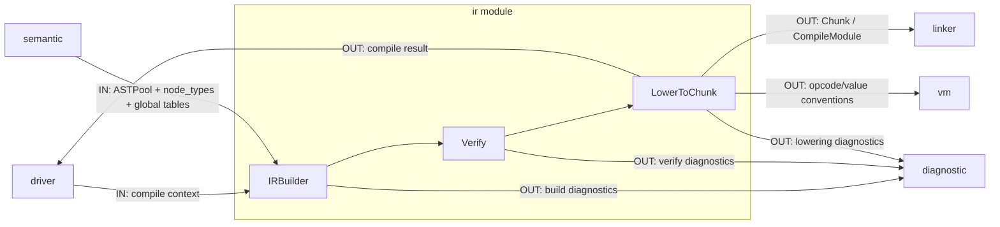

# IR 模块说明

`ir` 负责将语义标注后的 AST 降解为可验证、可执行的中间表示与字节码产物。

## 职责

- IR 构建
  - `IRBuilder`：`ASTPool + node_types + 全局语义表 -> ModuleIR`
- IR 校验
  - `verifyModuleIRFlat`：检查控制流、值引用与模块一致性
- IR 降级
  - `lowerModuleToChunk`：`ModuleIR -> vm::Chunk`

## 模块内数据流

## 数据边界

- 输入：`ASTPool`、`root`、`node_types`、`GlobalSymbolTable`、`GlobalTypeArena`
- 输出：`ModuleIR`、`vm::Chunk`（以及 Driver 组织的 `CompileModule`）

## 模块间依赖

- 依赖模块
  - `semantic`
    - 读取语义阶段回填的 `node_types` 与全局语义对象。
  - `vm`
    - 使用 `Chunk`、`Opcode`、`Value` 等运行时约定作为降级目标。
  - `diagnostic`
    - 构建/校验/降级阶段统一上报错误。
- 被依赖模块
  - `driver`
    - 串联 IR 构建、校验与降级阶段。
  - `linker`
    - 消费降级后的模块产物进行链接。

## 关键对象

- `ModuleIR`：模块级中间表示
- `IRBuilder`：AST 到 IR 的构建入口
- `verifyModuleIRFlat`：IR 一致性校验入口
- `lowerModuleToChunk`：IR 到字节码的降级入口

## 阶段接口（对外）

- Build
  - 输入：`ASTPool + root + node_types + 全局语义表`
  - 输出：`ModuleIR` 或构建诊断
- Verify
  - 输入：`ModuleIR`
  - 输出：校验结果或诊断
- Lower
  - 输入：`ModuleIR`
  - 输出：`vm::Chunk` 或降级诊断

## 接口契约（输入/输出/失败语义）

- Build（`IRBuilder::buildModule`）
  - 输入对象：`ASTPool&`、`root`、`node_types`、`global_symbols`、`global_arena`
  - 输出对象：`std::expected<ModuleIR, DiagnosticBag>`
  - 失败语义：遇到未支持 AST 形态或类型缺失时返回 `unexpected(DiagnosticBag)`
  - 错误码来源：`diagnostic` 模块内部映射（事件码：`diagnostic::events::CompileCode`）
- Verify（`verifyModuleIRFlat`）
  - 输入对象：`const ModuleIR&`
  - 输出对象：`std::expected<void, DiagnosticBag>`
  - 失败语义：IR 不满足结构约束时返回 `unexpected(DiagnosticBag)`，禁止进入 Lower 阶段
  - 错误码来源：`diagnostic` 模块内部映射（事件码：`diagnostic::events::CompileCode`）
- Lower（`lowerModuleToChunk`）
  - 输入对象：`const ModuleIR&`
  - 输出对象：`std::expected<vm::Chunk, DiagnosticBag>`
  - 失败语义：遇到不可降级节点或不支持 opcode 时返回 `unexpected(DiagnosticBag)`
  - 错误码来源：`diagnostic` 模块内部映射（事件码：`diagnostic::events::CompileCode`）

## 主要文件

- IR 对象
  - `ir/module_ir.hpp`
  - `src/l0_core/ir/module_ir.cpp`
- IR 构建
  - `ir/builder.hpp`
  - `src/l0_core/ir/builder.cpp`
  - `src/l0_core/ir/builder_declaration.cpp`
  - `src/l0_core/ir/builder_statement.cpp`
  - `src/l0_core/ir/builder_expression.cpp`
- IR 校验
  - `ir/verify.hpp`
  - `src/l0_core/ir/verify.cpp`
- IR 降级
  - `ir/lower_to_chunk.hpp`
  - `src/l0_core/ir/lower_to_chunk.cpp`

