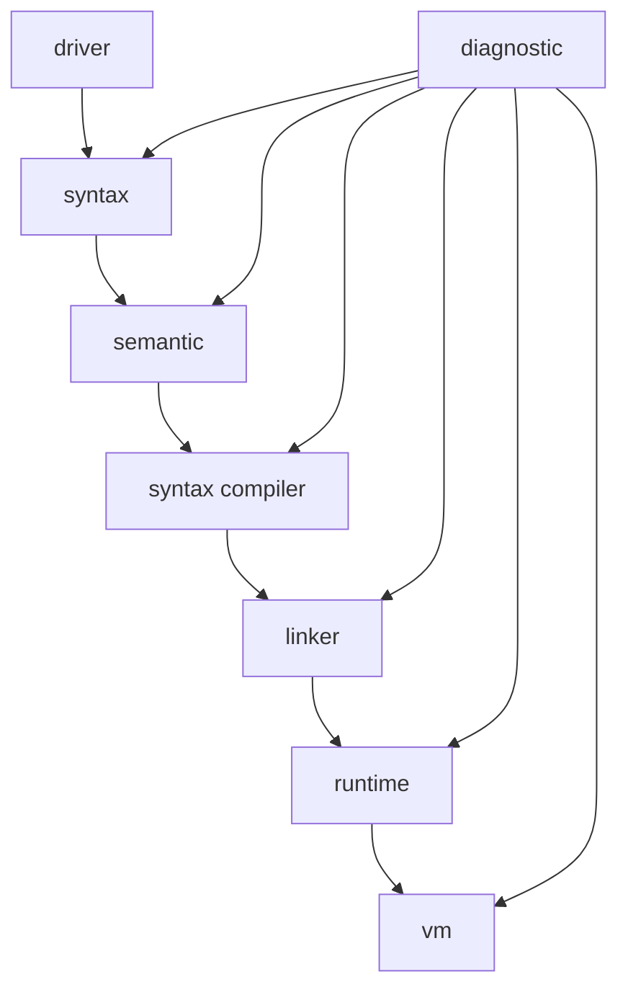
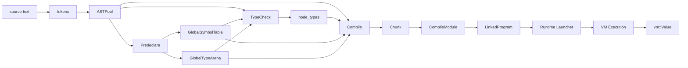
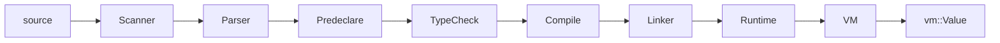
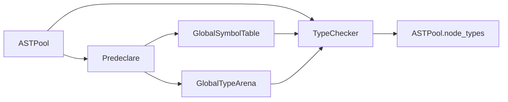
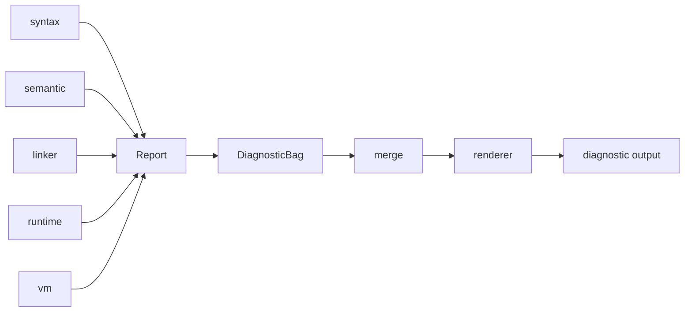
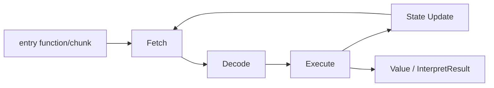

# Niki L0 Core 总览

`l0_core` 是 Niki 的编译-链接-运行基础层。  
本文件仅提供：

- 顶层模块关系
- 端到端数据流模型
- 各子模块文档索引

## 子模块文档

- `l0_core/syntax/readme.md`
- `l0_core/semantic/readme.md`
- `l0_core/linker/readme.md`
- `l0_core/runtime/readme.md`
- `l0_core/vm/readme.md`
- `l0_core/diagnostic/readme.md`

## 顶层模块关系



## 数据流转模型



## 五条主链路（图）

### 1) 编译执行主链



### 2) 语义分析链



### 3) 报错诊断链



### 4) 链接装载链

```mermaid
graph LR
    CM[CompileModule[]] --> LK[Linker]
    LK --> LP[LinkedProgram]
    LP --> LA[Launcher]
    LA --> VM[VM ready state]
```

### 5) 运行时执行链



## 阶段索引

- Pass-1 Parse
  - 输入：`source text`
  - 输出：`GlobalCompilationUnit{tokens, ASTPool, root}`
  - 细节：`syntax/readme.md`
- Pass-2 Predeclare
  - 输入：全部 Unit AST
  - 输出：`GlobalSymbolTable` + `GlobalTypeArena`
  - 细节：`semantic/readme.md`
- Pass-3 TypeCheck
  - 输入：`ASTPool` + 全局语义表
  - 输出：`ASTPool.node_types`
  - 细节：`semantic/readme.md`
- Pass-4 Compile
  - 输入：`ASTPool` + `node_types` + 全局语义表
  - 输出：`Chunk` / `CompileModule`
  - 细节：`syntax/readme.md`
- Link + Run
  - 输入：模块集合
  - 输出：`vm::Value`
  - 细节：`linker/readme.md`、`runtime/readme.md`、`vm/readme.md`