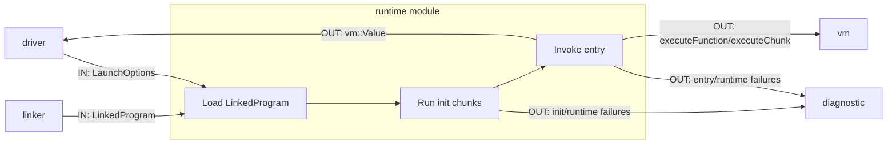

# Runtime 模块说明

`runtime` 负责程序装载与启动流程编排。

## 职责

- 接收 `LinkedProgram`
- 初始化/调用 VM 执行入口
- 返回最终运行结果或运行期诊断

## 模块内数据流

## 数据边界

- 输入：`LinkedProgram`
- 输出：`vm::Value` 或 `DiagnosticBag`

## 模块间依赖

- 依赖模块
  - `linker`
    - 读取链接后的程序表示 `LinkedProgram`。
  - `vm`
    - 通过 `VM` 执行入口逻辑并返回结果。
  - `diagnostic`
    - 运行期启动/装载/入口执行错误统一上报。
- 被依赖模块
  - `driver`：项目总入口最终调用运行阶段。

## 阶段接口（对外）

- Launch
  - 输入：`VM`、`LinkedProgram`、启动选项
  - 输出：`vm::Value` 或运行期诊断

## 接口契约（输入/输出/失败语义）

- Launcher（`Launcher::launchProgram`）
  - 输入对象：`vm::VM&`、`linker::LinkedProgram`、`LaunchOptions`
  - 输出对象：`std::expected<vm::Value, DiagnosticBag>`
  - 失败语义：初始化 chunk 执行失败、入口查找失败、入口执行失败均返回 `unexpected(DiagnosticBag)`
  - 错误码来源：`diagnostic::codes::launcher::*`

## 主要文件

- `runtime/launcher.hpp`
- `src/l0_core/runtime/launcher.cpp`
