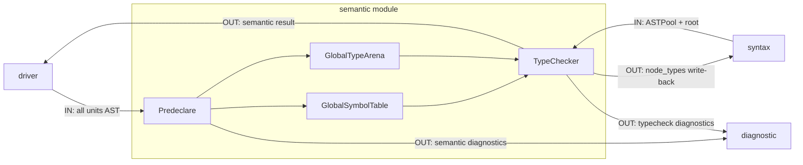

# Semantic 模块说明

`semantic` 负责类型系统、语义约束与跨文件语义一致性。

## 职责

- Predeclare（全局预声明）
  - 从各 Unit 顶层声明提取可跨文件实体（函数/结构体等）
  - 写入 `GlobalSymbolTable` 与 `GlobalTypeArena`
- TypeCheck（类型检查）
  - 在共享全局语义上下文中检查表达式/语句/声明
  - 将推导结果写回 `ASTPool.node_types`

## 模块内数据流

## 数据边界

- 输入：`ASTPool`、`root`、`GlobalSymbolTable`、`GlobalTypeArena`
- 输出：`node_types` 回填结果与 `DiagnosticBag`

## 模块间依赖

- 依赖模块
  - `syntax`
    - 读取 `ASTPool`、`ASTNode`、位置信息与节点 payload。
  - `diagnostic`
    - 统一报告语义错误与类型冲突。
- 被依赖模块
  - `driver`
    - 调度 Predeclare 与 TypeCheck 阶段。
  - `syntax`（Compiler 后端）
    - 读取 `node_types` 与全局语义表，做类型驱动代码生成。

## 关键对象

- `NKType`：静态类型值对象
- `GlobalSymbolTable`：名字到符号信息的全局映射
- `GlobalTypeArena`：全局类型实体仓库（结构体信息/函数签名 ID）
- `TypeChecker`：统一语义检查入口

## 阶段接口（对外）

- Predeclare
  - 输入：全部 Unit 的顶层声明 AST
  - 输出：`GlobalSymbolTable`、`GlobalTypeArena`
- TypeCheck
  - 输入：单 Unit `ASTPool + root` 与全局语义表
  - 输出：`ASTPool.node_types`、`DiagnosticBag`

## 接口契约（输入/输出/失败语义）

- Predeclare（由 Driver 组织调用）
  - 输入对象：各 `GlobalCompilationUnit` 的顶层声明 AST
  - 输出对象：填充后的 `GlobalSymbolTable`、`GlobalTypeArena`
  - 失败语义：预声明冲突/非法签名写入 `DiagnosticBag`；任一失败会阻止后续全局语义阶段
  - 错误码来源：`diagnostic::codes::semantic::*`
- TypeCheck（`TypeChecker::check`）
  - 输入对象：`ASTPool&`、`root`、`global_symbols`、`global_arena`
  - 输出对象：`std::expected<TypeCheckResult, DiagnosticBag>`，并回填 `ASTPool.node_types`
  - 失败语义：返回 `unexpected(DiagnosticBag)`；`node_types` 可能是部分回填状态
  - 错误码来源：`diagnostic::codes::semantic::*`

## 主要文件

- 类型系统
  - `semantic/nktype.hpp`
- 全局语义表
  - `semantic/global_symbol_table.hpp`
  - `src/l0_core/semantic/global_symbol_table.cpp`
  - `semantic/global_type_arena.hpp`
  - `src/l0_core/semantic/global_type_arena.cpp`
- 类型检查
  - `semantic/type_checker.hpp`
  - `src/l0_core/semantic/type_checker.cpp`
  - `src/l0_core/semantic/type_checker_pre_decl.cpp`
  - `src/l0_core/semantic/type_checker_decl.cpp`
  - `src/l0_core/semantic/type_checker_stmt.cpp`
  - `src/l0_core/semantic/type_checker_expr.cpp`
