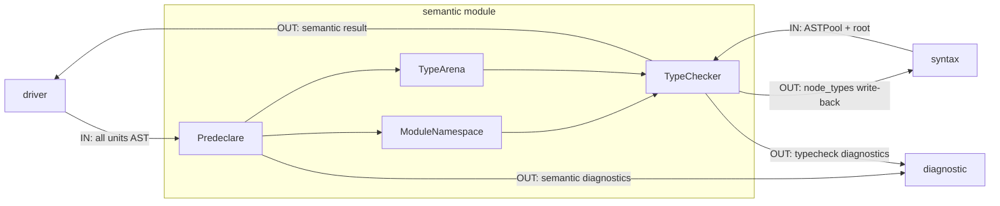

# Semantic 模块说明

`semantic` 负责类型系统、语义约束与跨文件语义一致性。

## 职责

- Predeclare（全局预声明）
  - 从各 Unit 顶层声明提取可跨文件实体（函数/结构体等）
  - 写入 `ModuleNamespace` 与 `TypeArena`
- TypeCheck（类型检查）
  - 在共享全局语义上下文中检查表达式/语句/声明
  - 将推导结果写回 `ASTPool.node_types`

## 模块内数据流

```mermaid
graph LR
    MOD_DRIVER[driver]
    MOD_SYNTAX[syntax]
    MOD_DIAG[diagnostic]

    subgraph SMM[semantic module]
        STAGE_PREDECLARE[Predeclare]
        STAGE_TYPECHECK[TypeChecker]
        OUT_MN[ModuleNamespace]
        OUT_GTA[TypeArena]
        STAGE_PREDECLARE --> OUT_MN
        STAGE_PREDECLARE --> OUT_GTA
        OUT_MN --> STAGE_TYPECHECK
        OUT_GTA --> STAGE_TYPECHECK
    end

    MOD_DRIVER -->|IN: all units AST| STAGE_PREDECLARE
    MOD_SYNTAX -->|IN: ASTPool + root| STAGE_TYPECHECK
    STAGE_TYPECHECK -->|OUT: node_types write-back| MOD_SYNTAX
    STAGE_TYPECHECK -->|OUT: semantic result| MOD_DRIVER

    STAGE_PREDECLARE -->|OUT: semantic diagnostics| MOD_DIAG
    STAGE_TYPECHECK -->|OUT: typecheck diagnostics| MOD_DIAG
```

## 数据边界

- 输入：`ASTPool`、`root`、`ModuleNamespace`、`TypeArena`
- 输出：`node_types` 回填结果与 `DiagnosticBag`

## 模块间依赖

- 依赖模块
  - `syntax`
    - 读取 `ASTPool`、`ASTNode`、位置信息与节点 payload。
  - `diagnostic`
    - 统一报告语义错误与类型冲突。
- 被依赖模块
  - `driver`
    - 调度 Predeclare 与 TypeCheck 阶段。
  - `ir`（IRBuilder）
    - 读取 `node_types` 与全局语义表，做 AST -> ModuleIR 降解。

## 关键对象

- `NKType`：静态类型值对象
- `ModuleNamespace`：模块作用域符号注册（`(module_id, name_id)` 复合键）
- `TypeArena`：全局类型实体仓库（结构体信息/函数签名 ID）
- `TypeChecker`：统一语义检查入口

## 阶段接口（对外）

- Predeclare
  - 输入：全部 Unit 的顶层声明 AST
  - 输出：`ModuleNamespace`、`TypeArena`
- TypeCheck
  - 输入：单 Unit `ASTPool + root` 与全局语义表
  - 输出：`ASTPool.node_types`、`DiagnosticBag`

## 接口契约（输入/输出/失败语义）

- Predeclare（由 Driver 组织调用）
  - 输入对象：各 `CompilationUnit` 的顶层声明 AST
  - 输出对象：填充后的 `ModuleNamespace`、`TypeArena`
  - 失败语义：预声明冲突/非法签名写入 `DiagnosticBag`；任一失败会阻止后续全局语义阶段
  - 错误码来源：`diagnostic` 模块内部映射（事件码：`diagnostic::events::SemanticCode`）
- TypeCheck（`TypeChecker::check`）
  - 输入对象：`ASTPool&`、`root`、`global_arena`、`module_id`、`module_namespace`
  - 输出对象：`std::expected<TypeCheckResult, DiagnosticBag>`，并回填 `ASTPool.node_types`
  - 失败语义：返回 `unexpected(DiagnosticBag)`；`node_types` 可能是部分回填状态
  - 错误码来源：`diagnostic` 模块内部映射（事件码：`diagnostic::events::SemanticCode`）

## 主要文件

- 类型系统
  - `semantic/nktype.hpp`
- 全局语义表
  - `semantic/module_namespace.hpp`
  - `src/l0_core/semantic/module_namespace.cpp`
  - `semantic/type_arena.hpp`
  - `src/l0_core/semantic/type_arena.cpp`
- 类型检查
  - `semantic/type_checker.hpp`
  - `src/l0_core/semantic/type_checker.cpp`
  - `src/l0_core/semantic/type_checker_pre_decl.cpp`
  - `src/l0_core/semantic/type_checker_decl.cpp`
  - `src/l0_core/semantic/type_checker_stmt.cpp`
  - `src/l0_core/semantic/type_checker_expr.cpp`

## 当前实现结构（2026-05）

- 语义阶段采用"两段式"组织：
  - `Predeclare(all units) -> TypeCheck(per unit)`
- `Predeclare` 负责模块级符号与类型实体建表，不参与表达式求型。
- `TypeCheck` 在共享全局语义上下文中回填 `ASTPool.node_types`。
- `ir` 仅消费语义结果，不在本模块重复执行类型推导。
