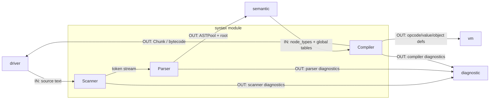

# Syntax 模块说明

`syntax` 负责词法、语法与字节码生成，分为前端与后端两部分。

## 职责

- 前端
  - `Scanner`：源码字符流 -> `Token` 序列
  - `Parser`：`Token` 序列 -> AST（写入 `ASTPool`）
- 后端
  - `Compiler`：`ASTPool + node_types` -> `Chunk`

## 模块内数据流

## 数据边界

- 输入
  - 前端：`source`（`std::string`）
  - 后端：`ASTPool`、`AST root`、`node_types`、全局语义表
- 输出
  - 前端：`GlobalCompilationUnit.tokens`、`ASTPool`、`root`
  - 后端：`Chunk`

## 模块间依赖

- 依赖模块
  - `semantic`
    - 编译后端读取 `node_types`；
    - 编译阶段可读取 `GlobalSymbolTable` / `GlobalTypeArena` 辅助类型驱动发射。
  - `vm`
    - `Compiler` 输出 `Chunk`，并使用 `vm::Value` / `Object` / `OPCODE` 相关定义。
  - `diagnostic`
    - Scanner / Parser / Compiler 统一上报诊断信息。
- 被依赖模块
  - `driver`：调用 Parse 与 Compile 阶段。
  - `semantic`：读取 `ASTPool` 进行类型检查。
  - `linker`（间接）：消费 Compiler 产物（经 Driver 封装为 `CompileModule`）。

## 关键设计

- Parser 使用 `std::span<const Token>` 零拷贝读取 token。
- AST 使用索引模型（`ASTNodeIndex` / `ASTListIndex`），避免裸指针生命周期问题。
- `ASTPool` 维护主表与旁侧表同下标对齐：
  - `nodes[i] <-> locations[i] <-> node_types[i]`

## 阶段接口（对外）

- Scan + Parse
  - 输入：`source`、`source_path`
  - 输出：`tokens`、`ASTPool`、`root`
- Compile
  - 输入：`ASTPool`、`root`、`node_types`、全局语义表
  - 输出：`Chunk`

## 接口契约（输入/输出/失败语义）

- Scanner（`Scanner::scanToken` + `takeDiagnostics`）
  - 输入对象：`std::string_view source`、`source_path`
  - 输出对象：逐次 `Token`；错误聚合在 `DiagnosticBag`
  - 失败语义：扫描不中断；非法字符以诊断记录，最终由上层检查 `DiagnosticBag` 决定是否终止流水线
  - 错误码来源：`diagnostic` 模块内部映射（事件码：`diagnostic::events::ScannerCode`）
- Parser（`Parser::parse`）
  - 输入对象：`source`、`std::span<const Token>`、`ASTPool&`
  - 输出对象：`ParseResult{root, diagnostics}`
  - 失败语义：返回部分 AST + 诊断（支持 panic/synchronize 错误恢复）
  - 错误码来源：`diagnostic` 模块内部映射（事件码：`diagnostic::events::ParserCode`）
- Compiler（`Compiler::compile`）
  - 输入对象：`ASTPool`、`ASTNodeIndex root`、`typeTable(node_types)`、可选全局语义表
  - 输出对象：`std::expected<Chunk, DiagnosticBag>`
  - 失败语义：返回 `unexpected(DiagnosticBag)`，当前单元编译失败
  - 错误码来源：`diagnostic` 模块内部映射（事件码：`diagnostic::events::CompilerCode`）

## 主要文件

- 词法
  - `syntax/scanner.hpp`
  - `src/l0_core/syntax/scanner.cpp`
- 语法
  - `syntax/parser.hpp`
  - `syntax/parser_precedence.hpp`
  - `src/l0_core/syntax/parse.cpp`
  - `src/l0_core/syntax/parser_declaration.cpp`
  - `src/l0_core/syntax/parser_statement.cpp`
  - `src/l0_core/syntax/parser_expression.cpp`
- AST
  - `syntax/ast.hpp`
  - `syntax/ast_payloads.hpp`
  - `src/l0_core/syntax/ast.cpp`
  - `syntax/token.hpp`
  - `syntax/global_interner.hpp`
  - `src/l0_core/syntax/global_interner.cpp`
- 编译后端
  - `syntax/compiler.hpp`
  - `src/l0_core/syntax/compiler.cpp`
  - `src/l0_core/syntax/compiler_pre_decl.cpp`
  - `src/l0_core/syntax/compiler_declaration.cpp`
  - `src/l0_core/syntax/compiler_statement.cpp`
  - `src/l0_core/syntax/compiler_expression.cpp`
