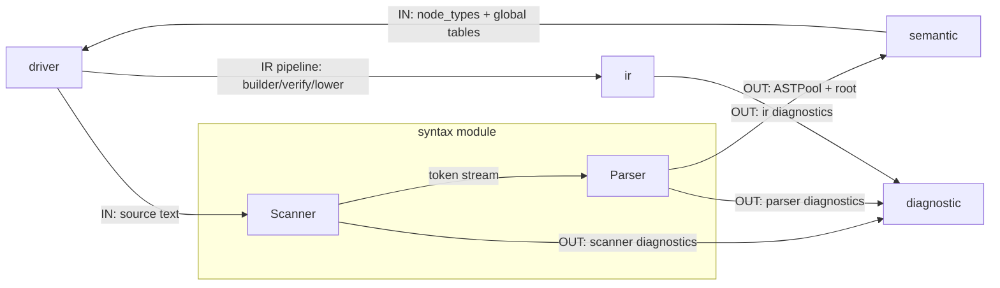

# Syntax 模块说明

`syntax` 负责词法与语法前端，不再承担字节码生成。

## 职责

- 前端
  - `Scanner`：源码字符流 -> `Token` 序列
  - `Parser`：`Token` 序列 -> AST（写入 `ASTPool`）
- 输出契约
  - `Scanner/Parser`：`source -> tokens + ASTPool + root`

## 模块内数据流

```mermaid
graph LR
    MOD_DRIVER[driver]
    MOD_SEMANTIC[semantic]
    MOD_IR[ir]
    MOD_DIAG[diagnostic]

    subgraph SXM[syntax module]
        STAGE_SCAN[Scanner]
        STAGE_PARSE[Parser]
        STAGE_SCAN -->|token stream| STAGE_PARSE
    end

    MOD_DRIVER -->|IN: source text| STAGE_SCAN
    STAGE_PARSE -->|OUT: ASTPool + root| MOD_SEMANTIC
    MOD_SEMANTIC -->|IN: node_types + global tables| MOD_DRIVER
    MOD_DRIVER -->|IR pipeline: builder/verify/lower| MOD_IR

    STAGE_SCAN -->|OUT: scanner diagnostics| MOD_DIAG
    STAGE_PARSE -->|OUT: parser diagnostics| MOD_DIAG
    MOD_IR -->|OUT: ir diagnostics| MOD_DIAG
```

## 数据边界

- 输入：`source`（`std::string`）
- 输出：`GlobalCompilationUnit.tokens`、`ASTPool`、`root`

## 模块间依赖

- 依赖模块
  - `semantic`
    - 类型检查回填 `node_types`，供后续 IRBuilder 使用。
  - `diagnostic`
    - Scanner / Parser 统一上报诊断信息。
- 被依赖模块
  - `driver`：调用扫描与解析阶段。
  - `semantic`：读取 `ASTPool` 进行类型检查。
  - `ir`（间接）
    - 通过 `driver` 消费语法阶段产出的 AST 与语义回填结果。

## 关键设计

- Parser 使用 `std::span<const Token>` 零拷贝读取 token。
- AST 使用索引模型（`ASTNodeIndex` / `ASTListIndex`），避免裸指针生命周期问题。
- `ASTPool` 维护主表与旁侧表同下标对齐：
  - `nodes[i] <-> locations[i] <-> node_types[i]`

## 阶段接口（对外）

- Parse
  - 输入：`source`、`source_path`
  - 输出：`tokens`、`ASTPool`、`root`

## 接口契约（输入/输出/失败语义）

- Scanner（`Scanner::scanToken` + `takeDiagnostics`）
  - 输入对象：`std::string_view source`、`source_path`
  - 输出对象：逐次 `Token`；错误聚合在 `DiagnosticBag`
  - 失败语义：扫描不中断；非法字符以诊断记录，最终由上层检查 `DiagnosticBag` 决定是否终止流水线
  - 错误码来源：`diagnostic` 模块内部映射（事件码：`diagnostic::events::ScannerCode`）
- Parser（`Parser::parse`）
  - 输入对象：`source`、`std::span<const Token>`、`ASTPool&`
  - 输出对象：`ParseResult{root, diagnostics}`
  - 失败语义：返回部分 AST + 诊断（支持 panic/synchronize 错误恢复）
  - 错误码来源：`diagnostic` 模块内部映射（事件码：`diagnostic::events::ParserCode`）

## 主要文件

- 词法
  - `syntax/scanner.hpp`
  - `src/l0_core/syntax/scanner.cpp`
- 语法
  - `syntax/parser.hpp`
  - `syntax/parser_precedence.hpp`
  - `src/l0_core/syntax/parse.cpp`
  - `src/l0_core/syntax/parser_declaration.cpp`
  - `src/l0_core/syntax/parser_statement.cpp`
  - `src/l0_core/syntax/parser_expression.cpp`
- AST
  - `syntax/ast.hpp`
  - `syntax/ast_payloads.hpp`
  - `src/l0_core/syntax/ast.cpp`
  - `syntax/token.hpp`
  - `syntax/global_interner.hpp`
  - `src/l0_core/syntax/global_interner.cpp`
- IR 后端（由 driver 调用）
  - `include/niki/l0_core/ir/builder.hpp`
  - `src/l0_core/ir/builder.cpp`
  - `src/l0_core/ir/builder_declaration.cpp`
  - `src/l0_core/ir/builder_statement.cpp`
  - `src/l0_core/ir/builder_expression.cpp`
