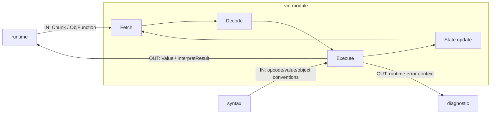

# VM 模块说明

`vm` 是字节码执行引擎，负责解释执行 `Chunk` 指令流。

## 职责

- 维护执行状态（寄存器窗口/调用帧/对象）
- 解释 opcode 并执行语义动作
- 管理运行时值与对象表示

## 模块内数据流

## 关键结构

- `Chunk`：指令与常量池载体
- `OPCODE`：指令枚举
- `Value`：运行时值类型
- `Object`：堆对象基类与派生对象
- `VM`：执行器主体

## 模块间依赖

- 依赖模块
  - `diagnostic`
    - VM 运行时错误通过统一诊断通道反馈。
- 被依赖模块
  - `runtime`：通过 `Launcher` 驱动 VM 执行。
  - `syntax`（Compiler）
    - 使用 VM 指令与值对象定义生成合法字节码。

## 阶段接口（对外）

- Execute
  - 输入：入口函数/主 `Chunk`、常量池与运行时上下文
  - 输出：执行结果 `vm::Value` 或运行时错误

## 接口契约（输入/输出/失败语义）

- VM 执行接口（`executeChunk` / `executeFunction`）
  - 输入对象：`Chunk` 或 `ObjFunction*`、打印选项
  - 输出对象：`std::expected<Value, InterpretResult>`
  - 失败语义：失败通过 `InterpretResult::RUNTIME_ERROR` 或 `COMPILE_ERROR` 反馈；上层（Launcher）将其映射为 `DiagnosticBag`
  - 错误码来源：VM 本层使用 `InterpretResult`；统一错误码在上层来自 `diagnostic` 模块内部映射（事件码：`diagnostic::events::LauncherCode`）

## 主要文件

- `vm/vm.hpp`
- `src/l0_core/vm/vm.cpp`
- `vm/chunk.hpp`
- `vm/opcode.hpp`
- `vm/value.hpp`
- `vm/object.hpp`
